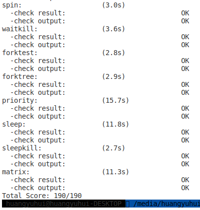

# 操作系统实验 Lab 7 同步互斥

## 实验目的

1. 理解操作系统的同步互斥的设计实现；

2. 理解底层支撑技术：禁用中断、定时器、等待队列；

3. 在ucore中理解信号量（semaphore）机制的具体实现；

4. 了解经典进程同步问题，并能使用同步机制解决进程同步问题。

## 实验内容

> 实验7（lab6）完成了用户进程的调度框架和具体的调度算法，可调度运行多个进程。如果多个进程需要协同操作或访问共享资源，则存在如何同步和有序竞争的问题。本次实验，主要是熟悉ucore的进程同步机制—信号量（semaphore）机制，以及基于信号量的哲学家就餐问题解决方案。在本次实验中，在kern/sync/check_sync.c中提供了一个基于信号量的哲学家就餐问题解法。
>
> 哲学家就餐问题描述如下：有五个哲学家，他们的生活方式是交替地进行思考和进餐。哲学家们公用一张圆桌，周围放有五把椅子，每人坐一把。在圆桌上有五个碗和五根筷子，当一个哲学家思考时，他不与其他人交谈，饥饿时便试图取用其左、右最靠近他的筷子，但他可能一根都拿不到。只有在他拿到两根筷子时，方能进餐，进餐完后，放下筷子又继续思考。

## 练习 0：填写已有实验

> 本实验依赖ucore实验1/2/3/4/5/6。请把你做的ucore实验1/2/3/4/5的代码填入本实验中代码中有“LAB1”,“LAB2” ,“LAB3”, “LAB4”,  “LAB5”, “LAB6”的注释相应部分。

本次代码合并没有难度，我们只需要修改 `trap.c` 中的 `trap_dispatch` 函数：

```cpp
    case IRQ_OFFSET + IRQ_TIMER:
        ++ticks;
        run_timer_list();
        break;
```

即可。

## 练习 1：理解内核级信号量的实现和基于内核级信号量的哲学家就餐问题

> 完成练习 0 后，建议大家比较一下（可用 meld 等文件 diff 比较软件）个人完成的 lab6 和练习 0 完成后的刚修改的 lab7 之间的区别，分析了解 lab7 采用信号量的执行过程。执行 make grade, 大部分测试用例应该通过。

### 内核级信号量的设计与执行流程

> 请在实验报告中给出内核级信号量的设计描述，并说其大致执行流流程。

#### 设计描述：`sem.h`

这个头文件描述了内核级信号量的设计描述，内核级信号量支持 V、P 操作，通过 `up`、`down` 函数实现。还支持 `try_down` 来支持非阻塞调用。

```cpp
/**
 * 信号量结构体
 */
typedef struct {
    // 信号量的值
    int value;

    // 该信号量的等待队列
    wait_queue_t wait_queue;
} semaphore_t;

/**
 * 初始化信号量的值和等待队列
 */
void sem_init(semaphore_t *sem, int value);

/**
 * 给信号量的值 + 1
 */
void up(semaphore_t *sem);

/**
 * 给信号量的值 - 1
 */
void down(semaphore_t *sem);

/**
 * @brief 尝试给信号量的值 - 1
 * @return 操作是否成功，非零值为成功
 */
bool try_down(semaphore_t *sem);
```

#### 执行流程

##### `sem_init`

这个函数初始化信号量的值和等待队列。

```cpp
void
sem_init(semaphore_t *sem, int value) {
    sem->value = value;
    wait_queue_init(&(sem->wait_queue));
}
```

##### `__up`

这个函数给信号量的值 + 1。操作流程是：

1. 关闭中断确保操作的原子性
2. 检查是否有进程等待该信号量
   1. 如果不存在，则给信号量值 + 1
   2. 否则唤醒一个正在等待该信号量的进程（这里唤醒了最早等待信号量的进程，即在队列头的进程），且不给信号量值 + 1（这是因为 `__down` 中也没有给信号量值 - 1）
3. 恢复中断

```cpp
static __noinline void __up(semaphore_t *sem, uint32_t wait_state) {
    bool intr_flag;
    // up 操作必须是原子操作，关闭中断以保证函数操作的原子性
    local_intr_save(intr_flag);
    {
        wait_t *wait;
        if ((wait = wait_queue_first(&(sem->wait_queue))) == NULL) {
            // 首先检查是否存在进程在等待这个信号量，如果没有进程持有这个
            // 信号量，则这个信号量是空闲的，可以直接 + 1
            sem->value ++;
        }
        else {
            assert(wait->proc->wait_state == wait_state);
            // 否则唤醒等待队列中的最早的进程，且因为这个进程会消耗掉当前
            // 的这个增量，因此不需要 + 1
            wakeup_wait(&(sem->wait_queue), wait, wait_state, 1);
        }
    }
    local_intr_restore(intr_flag);
}
```

##### `__down`

这个函数给信号量的值 - 1，并返回进程被唤醒的原因。这个函数的操作流程是：

1. 关闭中断确保操作的原子性
2. 检查信号量值是否可以直接减
   1. 如果可以直接减，则执行操作并返回，且恢复中断
   2. 否则需要等待信号量的 up 操作（或者出现可以使用的资源）
3. 等待信号量，将当前进程标记为等待信号量的状态，并发起调度，让出 CPU 执行权
4. 等到恢复执行权后，此时当前进程理应获得信号量，将进程移除出信号量的等待队列
5. 检查当前进程被唤醒的原因，如果不是因为获得信号量而唤醒的，则说明代码有问题

```cpp
static __noinline uint32_t __down(semaphore_t *sem, uint32_t wait_state) {
    bool intr_flag;
    // down 操作必须是原子操作，关闭中断以保证函数操作的原子性
    local_intr_save(intr_flag);
    // 检查信号量值是否可以直接减（是否还有表示的资源？）
    if (sem->value > 0) {
        // 如果有则直接减即可
        sem->value --;
        local_intr_restore(intr_flag);
        return 0;
    }
    wait_t __wait, *wait = &__wait;
    // 将当前进程标记为 PROC_SLEEPING 并加入等待队列中
    wait_current_set(&(sem->wait_queue), wait, wait_state);
    local_intr_restore(intr_flag);

    // 发起调度交出 CPU 执行权（和 Thread.yield 比较相似）
    // 由于 schedule 执行时会关闭中断，因此我们这里需要先
    // 恢复中断，调度完成恢复执行后再关闭中断。
    schedule();

    // schedule 函数执行结束后 CPU 执行权将回到该进程
    // 对信号量的操作以及等待队列的操作必须是原子操作
    local_intr_save(intr_flag);
    {
        // 当前进程被唤醒是因为此时发生了一次 up 操作，
        // 由于 up 操作中唤醒其他进程时没有为 value + 1，
        // 这里也不需要执行 value - 1
        wait_current_del(&(sem->wait_queue), wait);
    }
    local_intr_restore(intr_flag);

    // 如果唤醒的原因不是因为信号量减操作，则返回唤醒的原因
    if (wait->wakeup_flags != wait_state) {
        return wait->wakeup_flags;
    }
    // 否则我们是因为信号量减操作才被唤醒的，返回 0 表示正常
    return 0;
}
```

##### `try_down`

该函数尝试给信号量的值 - 1，并返回是否成功完成了操作。

```cpp
bool
try_down(semaphore_t *sem) {
    bool intr_flag, ret = 0;
    // down 操作必须是原子操作，关闭中断以保证函数操作的原子性
    local_intr_save(intr_flag);
    // 检查值是否可以直接减（是否还有表示的资源？）
    if (sem->value > 0) {
        // 返回减操作成功执行
        sem->value --, ret = 1;
    }
    local_intr_restore(intr_flag);
    return ret;
}
```

#### 实验结果



### 用户态进程/线程提供信号量机制的设计方案

> 请在实验报告中给出给用户态进程/线程提供信号量机制的设计方案，并比较说明给内核级提供信号量机制的异同。

#### 设计方案

用户态的信号量机制实现需要操作系统的内核态信号量提供支持。操作系统需要向用户态开放系统调用以操作内核态信号量。

* `int    sem_close(sem_t *);`：关闭有名信号量，有名信号量是内核持续的，需要进程手动关闭。
* `int    sem_destroy(sem_t *);`：销毁无名信号量，无名信号量是进程持续的，进程退出后自动销毁。
* `int    sem_getvalue(sem_t *restrict, int *restrict);`：获得信号量的值
* `int    sem_init(sem_t *, int, unsigned);`：创建无名信号量，通过调用 `sem.h:sem_init` 来实现
* `sem_t *sem_open(const char *, int, ...);`：打开有名信号量
* `int    sem_post(sem_t *);`：信号量的 V 操作，通过调用内核态的 `sem.h:up` 函数实现
  `int    sem_timedwait(sem_t *restrict, const struct timespec *restrict);`
* `int    sem_trywait(sem_t *);`：信号量的 P 操作，通过调用内核态的 `sem.h:try_down` 实现
  `int    sem_unlink(const char *);`：关闭有名信号量
  `int    sem_wait(sem_t *);`：信号量的 P 操作，通过调用内核态的 `sem.h:down` 函数实现

#### 异同

1. 用户态信号量的使用方法和内核态信号量的使用方法一致
2. 用户态信号量依赖于内核级信号量，需要通过操作系统提供的系统调用实现用户态信号量

## 实验分析

本次实验代码填写部分很少，且填写部分很简单，因此我的实现与答案是一致的。

## 实验心得

### 知识点

通过本次学习：

1. 我了解了进程间同步互斥的实现方法；
2. 我了解了内核级信号量的实现方法；
3. 我了解了关闭中断以实现原子操作的重要性；
4. 我了解了实现进程有条件地等待的方法（通过 `schedule` 和 `wakeup_proc` 组合来实现进程的等待），通过 `wait_queue` 来实现信号量的有条件等待机制。

### 心得体会

本实验让我了解了信号量实现的底层机制。之前我都只是知道信号量的简单使用方法，但一直不知道操作系统是如何实现的。现在我知道单核心的操作系统通过维护每个信号量的等待队列来维护等待进程，通过关闭中断来确保信号量操作的原子性。这让我进一步加深了对同步互斥概念与实现的理解。

